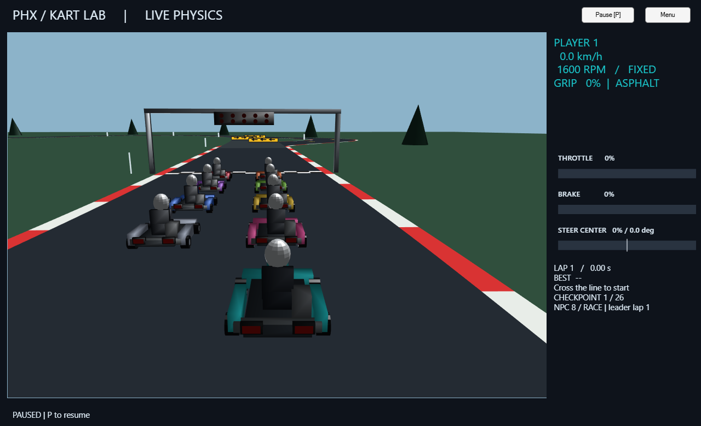
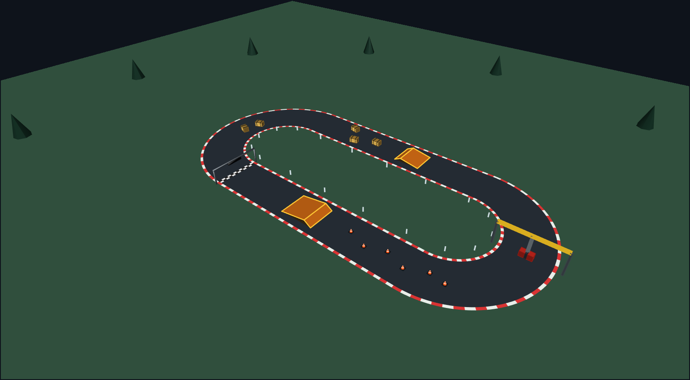

# PHX Kart Lab

[](https://matlab.mathworks.com/open/github/v1?repo=SurfinBird95/PHX_Kart_Demo&project=matlab.toml)

A playable kart racing demo built in MATLAB with **PHX Toolbox by Lubor Zháňal / HUMUSOFT**, developed iteratively with **OpenAI Codex and ChatGPT**.

Race alone, share a keyboard with a friend, or add up to eight NPC opponents. This is an interactive physics demo with deliberately tuned handling, not a validated vehicle simulator.



## Requirements

| Component | Requirement |
| --- | --- |
| MATLAB | R2025a or newer; tested with R2026a Update 5 on Windows |
| PHX Toolbox | Version 1.0.9 or newer; declared as a project dependency for R2026b+. Tested locally with 1.0.9 |
| Input and display | Keyboard and interactive graphics; Windows desktop tested, MATLAB Online verification pending |

No Simulink, MATLAB Compiler, Python, OpenAI account or API key is required to play. MATLAB Runtime alone cannot run these source files. Additional MathWorks products were not identified by MATLAB dependency analysis.

PHX supports Windows, macOS and Linux; this demo has only been tested on Windows. The minimum MATLAB release follows the [PHX requirements](https://www.humusoft.eu/en/blog/phx-preview-eng/); older supported releases have not been tested with this demo.

## Open in MATLAB Online / R2026b+

Click **Open in MATLAB Online** above and sign in to your MathWorks account. The link requests a clone of this repository and opens `matlab.toml` as a MATLAB project. This project format requires **R2026b or newer**; the badge does not select a specific MATLAB release.

The project declares `PHXToolbox >=1.0.9`. MATLAB resolves package dependencies from its configured repositories when the project opens. Complete any dependency or project-startup prompts that MATLAB presents. Once dependencies are available, the startup function opens the game menu. The **Play PHX Kart Lab** project shortcut reopens it later.

If only the repository opens, double-click `matlab.toml` in the Files panel to open the project. If the game menu does not appear, run `start_kart_lab`. If dependency resolution fails, inspect the project's issues and package-manager message; the manual installation route below remains available.

**Validation status:** TOML syntax and referenced paths have been checked, and the launcher has been tested locally in R2026a. Project loading, automatic PHX installation, and gameplay in R2026b/MATLAB Online have **not yet been verified**. In the browser, start with one player and no NPCs, click the game view before using the keyboard, and then increase the NPC count if performance permits.

### Verify automatic setup

1. Use a MATLAB Online environment where PHX has not already been installed. Do not uninstall a working copy just for this test; an existing installation can verify launch, but not first-time dependency installation.
2. Click the badge and check `version('-release')`: it must report R2026b or newer.
3. Open `matlab.toml` as a project and let dependency resolution finish. Do **not** run `mpminstall` manually during this test.
4. Run `which phx.Simulation` and `which phx_kart_demo`. Both must return file paths, with the demo coming from the cloned repository.
5. Check that the menu opens. Select a track, start driving, wait for lights out, and try steering, braking, pause, and reset. Then try NPCs and split screen.

If something fails, report the MATLAB release, the full error message, and whether PHX was already installed. A successful local R2026a launch alone does not verify the R2026b dependency workflow.

This setup follows the MathWorks documentation for [TOML projects and automatic dependencies](https://www.mathworks.com/help/matlab/matlab_prog/toml-format-for-matlab-projects.html), [configuration syntax](https://www.mathworks.com/help/matlab/ref/matlab.toml.html), and [Open in MATLAB Online links](https://www.mathworks.com/help/matlab/matlab_env/open-github-repositories-in-matlab-online.html).

## Download and play (including R2025a / R2026a)

The existing direct-launch workflow is unchanged. These releases do not require opening `matlab.toml`.

1. Install PHX Toolbox through MATLAB's Add-On Explorer (search for **PHX Toolbox**), or download `PHXToolbox.mltbx` from the [official PHX releases](https://github.com/Humusoft/phx/releases) and open it in MATLAB.

   Alternatively, if PHX is available in your package manager's configured repositories, run `mpminstall PHXToolbox`.
2. [Download this repository as a ZIP](https://github.com/SurfinBird95/PHX_Kart_Demo/archive/refs/heads/main.zip) and extract it, or clone it:

   ```sh
   git clone https://github.com/SurfinBird95/PHX_Kart_Demo.git
   ```

3. In MATLAB, open the extracted/cloned `PHX_Kart_Demo` folder as the **Current Folder**. Keep `phx_kart_demo.m` and the `+phxkart` folder together.
4. Run:

   ```matlab
   phx_kart_demo
   ```

Choose the number of players, track, drivetrain, NPC count and difficulty, then select **START DRIVING**. Wait for the five red lights to go out before driving away.

To launch a configured session directly:

```matlab
% Two local players and four NPCs on the default technical circuit
phx_kart_demo(Start=true, Players=2, NPCs=4, Difficulty="hard")

% Solo, six-speed manual, banked figure-eight track
phx_kart_demo(Start=true, Track="eight", Manual=true)

% Compact obstacle course with ramps and movable obstacles
phx_kart_demo(Start=true, Track="obstacle")
```

`Manual=[true false]` gives player 1 a manual gearbox and player 2 a single-speed kart. Multiplayer is local split screen on one computer; there is no online multiplayer.

## Controls

| Action | Player 1 | Player 2 |
| --- | --- | --- |
| Accelerate | W | Up arrow |
| Brake / single-speed reverse | S | Down arrow |
| Steer left / right | A / D | Left / right arrows |
| Shift down / up (manual) | X / C | N / M |

**P** pauses, **R** resets the complete grid and lap times, and **Esc** returns to the menu. Closing the window stops the demo and releases its simulation and timer.

- **Single-speed:** brake to a stop, release the brake key, then press it again to reverse. Accelerating while reversing brakes to a stop before driving forward.
- **Manual:** sequential gears are **R – N – 1 – 2 – 3 – 4 – 5 – 6**. Select reverse near standstill, then use the accelerator to move backwards.
- Open **Settings** from the menu to adjust the control response. Longer response times make throttle, brake and steering inputs build up more slowly. HUD bars show the inputs actually being applied.

## What's included

- **Technical Circuit** (default): flowing corners, a tight chicane and an alternative obstacle route inspired by the Rettifilo escape lane. Both routes count when their checkpoints are followed.
- **Oval:** a simple circuit for getting used to the controls.
- **Figure eight:** an at-grade crossing, a banked outer corner with a red high-grip surface, barriers and trackside banners.
- **Obstacle Course:** a compact stadium loop with two full-width jump ramps, a swinging hammer, five movable hay bales and six orange-and-white traffic cones arranged as a slalom after the first jump. Keep some speed for the jumps, time your passage past the hammer, and push the bales or cones out of your way. **R** restores the obstacles as well as the karts. Available in single-player, split screen and with NPCs.
- **0–8 NPCs**, with **Easy / Medium / Hard / Race** difficulty; up to ten karts with two human players.
- Chase cameras, equal split-screen views, brake lights, start lights, reverse, lap timing and checkpoints.
- HUD speed, engine RPM, gear, grip indication, lap information and throttle/brake/steering bars.

There is no fixed race length or championship. The single-speed and manual drivetrains use different engine setups and are not performance-balanced classes. NPCs can collide or become stuck; this is part of a prototype rather than polished racing AI.

## Physics and performance

PHX handles rigid-body stepping and physical contacts. The demo supplies its own approximate engine, tyre, drivetrain and control models. Vehicle motion is primarily planar, with additional banked-surface forces and visual tilt. Grip and steering assistance have been tuned for keyboard play, including intentionally increased grip on the red surface.

The obstacle course adds vertical motion: ramp support, ballistic flight under gravity and landing. Tyre forces are disabled while airborne; the HUD shows **AIRBORNE**. This remains a simplified height-field model rather than a full suspension/contact simulation. Left/right wheel support drives a reduced roll model: straddling a ramp edge can tip the kart onto its side. A rolled kart loses tyre drive and automatically recovers after two simulation seconds. It returns upright and stationary to the nearest clear, flat spot within 12 metres of the overturned kart; if the local area is blocked, it waits instead of returning to the start. This affects only that kart, preserves completed lap times and marks the current lap invalid. The HUD shows the recovery countdown. **R** remains the full-grid reset. The hammer is a prescribed pendulum with a PHX kinematic collider. Hay bales and lightweight cones are dynamic PHX bodies with simplified box colliders, constrained upright to the ground with sliding drag. NPCs use a conservative speed cap on this course and can be struck or blocked by obstacles.



More opponents and two rendered views increase computation and drawing time. If the game runs slowly, reduce the NPC count or switch to one player. Some keyboards cannot register all the keys required by two players at once.

## Troubleshooting

- **Missing PHX Toolbox:** run `which phx.Simulation` in MATLAB. If nothing is found, install/enable PHX and restart MATLAB if necessary.
- **Missing `phxkart` function:** extract the whole repository and set its root as the Current Folder. Do not move just the main `.m` file or add the inside of `+phxkart` as a standalone path.
- **Keys do nothing:** click the game window, check that it is not paused, and wait for the start lights to go out.
- **Another copy runs:** use `which phx_kart_demo -all` and remove obsolete demo folders from your MATLAB path.

## Tests and source layout

`phx_kart_demo.m` is the entry point. `+phxkart/` contains tracks, rendering, vehicle behaviour, NPC control and race timing. `tests/` contains the existing regression checks. The PHX Toolbox itself is not bundled.

From the repository root, run the baseline checks:

```matlab
addpath('tests')
phx_kart_demo_test
phx_kart_controls_test
phx_kart_start_reverse_test
phx_kart_escape_test
phx_kart_bank_test
phx_kart_npc_test("gui")
phx_kart_obstacle_test
phx_kart_rollover_test
phx_kart_recovery_test
```

Additional, longer checks are `phx_kart_handling_test`, `phx_kart_npc_test` and `phx_kart_npc_pack_test`. Tests may create preview PNGs and briefly open graphics windows; generated files are ignored by Git.

## Credits and development

- **PHX Toolbox:** Lubor Zháňal / **HUMUSOFT**. See the [official toolbox repository](https://github.com/Humusoft/phx) and [introduction](https://www.humusoft.eu/en/blog/phx-preview-eng/).
- **Demo concept, direction and iterative feedback:** [SurfinBird95](https://github.com/SurfinBird95).
- **AI-assisted implementation and documentation:** OpenAI **Codex / ChatGPT**. The repository-preparation session used **GPT-6 in Codex**. Exact model versions for earlier development sessions were not recorded, so this is not a claim that every revision used the same model. AI services are development tools only and are not used by the running game.

Trackside names (Škoda, Continental, Valeo, Humusoft, #AutaVUT and UADI) are decorative references, not claims of sponsorship or endorsement.

## License status

No license has been selected for the demo's own source code yet. Public access is not a general grant of permission to reuse or redistribute it; contact the repository owner about such permissions.

PHX Toolbox is a separate dependency governed by its own license. Obtain it directly from its official distribution; no PHX source or binaries are redistributed here.
